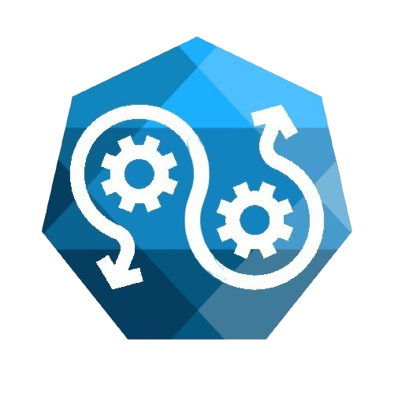

 

 
<h1> GARMS: Pipeline CI/CD</h1>

<h2>Sobre o Repositório:</h2>
<a>Repositório com documentação para permitir um hud de testes para estudar seguindo o fluxo de contéudo do TCC.</a>

 
<strong>Colaboradores:</strong> 
<a> João Emanuel</a> 
<a>Mateus Sousa</a> 
<a>Murilo Weishaupt</a>  

<h2>Descrição do Projeto</h2>

Este repositório contém testes dos recursos para facilitar a implementação de uma esteira CI/CD (Integração Contínua e Entrega Contínua), alinhada ao fluxo de conteúdo das aulas do curso técnico de Redes de  Computador da instituição ETEC de Embu. A esteira CI/CD é fundamental para otimizar o desenvolvimento de software, permitindo que as equipes integrem e entreguem código de forma mais rápida e eficiente.

<h2>Benefícios da Esteira CI/CD:</h2>

- **Automação:** A automação de processos reduz a intervenção manual, minimizando erros e aumentando a eficiência.

- **Feedback Rápido:** Com testes automatizados, as equipes recebem feedback imediato sobre a qualidade do código, permitindo correções rápidas.

- **Implantações Frequentes:** A entrega contínua possibilita que novas funcionalidades sejam lançadas rapidamente, melhorando a experiência do usuário.

- **Melhoria da Qualidade do Software:** O uso de testes automatizados e revisões constantes contribui para um código mais robusto e seguro.

- **Colaboração Aprimorada:** A integração contínua promove uma cultura de colaboração entre desenvolvedores, testadores e operações, resultando em um fluxo de trabalho mais coeso.

 

<h2>Conclusão</h2>

O projeto visa não apenas a formação técnica, mas também a criação de um ambiente colaborativo onde os participantes possam aprender e aplicar práticas de segurança desde o início do desenvolvimento. Através deste repositório, esperamos fomentar a troca de conhecimento e a melhoria contínua nas práticas de DevSecOps.
